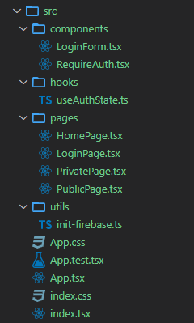
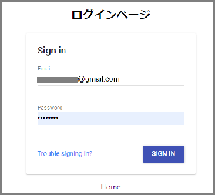

# React Router V6とFirebase 認証(react-firebaseui利用)サンプル

React Router V6 とFirebase Authenticationを組み合わせて、特定ページに認証をかけるサンプルです。

* 原因がわからないのですが(仕様？)ログイン後に、該当ページへ移動する際、ページのリロードが発生するようです。対策のため、react-firebaseuiの画面遷移を止めて、navigateフックで画面を遷移するようにしました。

## 目的、機能

1. React Router V6で画面遷移をする
1. Firebaseでログイン、ログアウト機能を実装する
1. ログイン画面は`react-firebaseui`を利用する(楽をする)
1. ログインが必要な場合に、画面をラップするコンポーネント`<RequireAuth>`を用意する(`<PrivateRoute>`代替。Routeをラップするコンポーネントは利用できなくなっています)
```jsx
  <Route path="/private" element={
      <RequireAuth>
        <PrivatePage />
      </RequireAuth>
    } />
```
1. ログイン状態はフックのみで管理する(ReduxやContexを利用しない)
1. 画面を閉じてもログインを(継続|継続しない)を.envで切り替えられるようにする


## React, firebaseのインストール

```bash
npm i react-router-dom
npm i firebase
```

## Firebaseコンソールから、メール認証を有効化

* 左側メニューから`Authentidation`を選択し、`始める`ボタンをクリック。


* ログイン方法の`メール/パスワード`をクリック。


* クリックで認証を有効にする


## File構成



|  ファイル名  |  概要  |
| ---- | :---- |
|  LoginForm.tsx  | react-firebaseuiを利用したログインフォーム  |
|  RequireAuth.tsx  |  認証が必要なページをラップすることで、認証を強制するコンポーネント  |
|  useAuthState.ts  |  ユーザーのサインイン状態を取得するためのカスタムフック  |
|  HomePage.tsx  |  トップページ。各画面へのリンクと、ログアウト機能。  |
|  LoginPage.tsx  |  ログインページ。ログイン後に表示するパスを引数で受け取る  |
|  privatePage.tsx  |  表示にログインを必要とするページ  |
|  PublicPage.tsx  |  表示にログインが不要なページ   |
|  init-firebase.ts  |  FirebaseApp初期化  |
|  App.tsx  |  ルート定義  |
|  index.tsx  |  init-firebaseを読み込み、初期化を行う  |
|  .env  |  Firebaseの設定と、認証の永続化設定  |

## 画面イメージ

未ログインの場合、ログインが必要なページをクリックすると、ログインページが表示されます。


ログイン画面



ログイン後に自動で遷移


ログイン済みであれば、直接開きます。


## FirebaseAppの初期化

index.tsxでimportすることで最初に1回初期化を実行する。

## ルート定義

認証が必要なページを`<RequireAuth>`で囲います。
```tsx
<Routes>
  <Route path="/" element={<HomePage />} />
  <Route path="/public" element={<PublicPage />} />
  <Route path="/private" element={<RequireAuth>
                                    <PrivatePage />
                                  </RequireAuth>} />
  <Route path="/signin" element={<LoginPage moveTo="/" />} />
</Routes>

```

## 参考にさせていただいたページ
https://dev.classmethod.jp/articles/react-router-5to6/
https://qiita.com/musatarosu/items/5411772d97f72d00d267
https://qiita.com/cola119/items/99350f2c34c51378777e

https://stackoverflow.com/questions/69864165/error-privateroute-is-not-a-route-component-all-component-children-of-rou

ReactRouterV5で利用していた`PrivateRoute`(ログイン時とログアウト時でページ遷移の許可をわける)がV6でできなくなったため、その対応策
```
function PrivateRoute({ element, path }) {
  const authed = isauth() // isauth() returns true or false based on localStorage
  const ele = authed === true ? element : <Navigate to="/Home"  />;
  return <Route path={path} element={ele} />;
}
```
下記のエラーが発生する
`Error: [PrivateRoute] is not a <Route> component. All component children of <Routes> must be a <Route> or <React.Fragment>`
